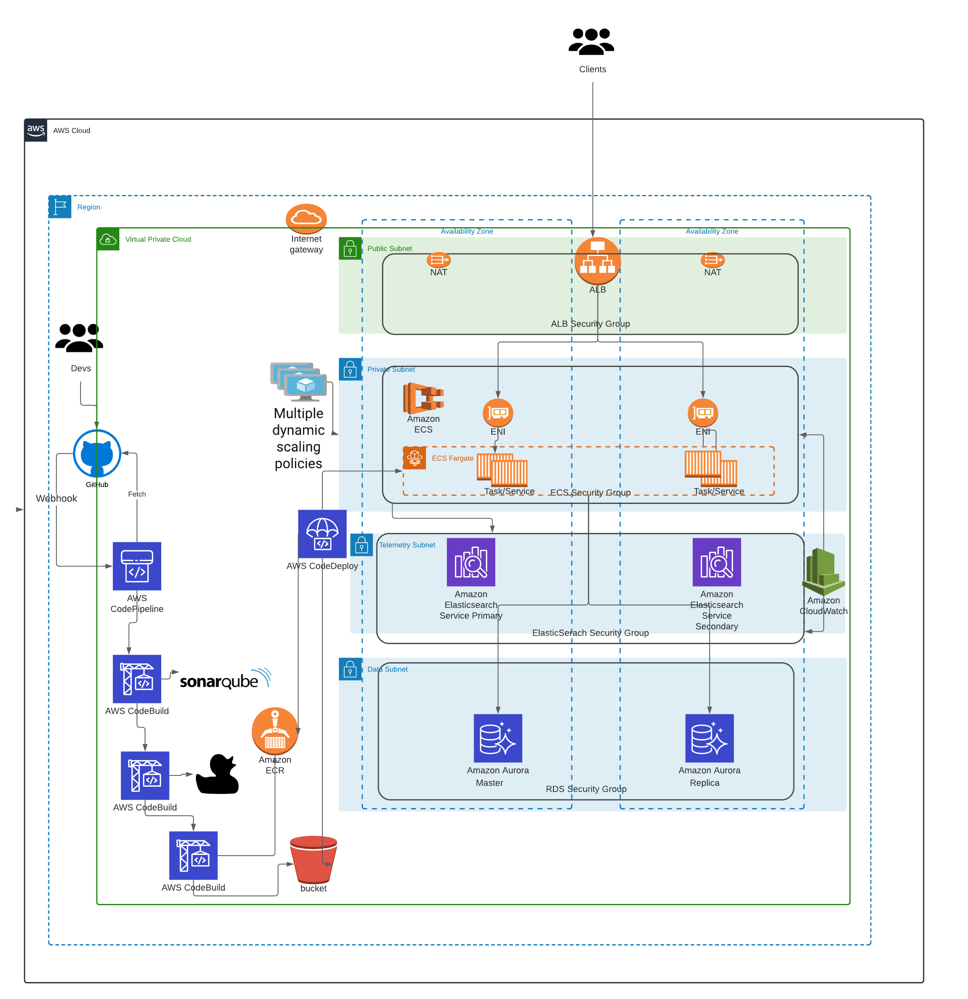

# ecs with Dynamic Scalablity High Availability and Disaster Recovery

ECS Fargate deployed with CI/CD integrated, Dynamic Scalablity, High availabilty and Disaster Recovery in Mind


## Summary

This repo will create your Staging and Production environments. Completed with the following modules:
  - alb
  - ecr
  - ecs_fargate
  - rds
  - security_groups
  - vpc
  - iam
  - codebuild
  - codepipeline

## Basic Architecture



## Built with:

* Terraform (v0.14.0)
* AWS_ACCESS_KEYS and AWS_SECRET_ACCESS_KEYS are set as environment variables (link: https://docs.aws.amazon.com/cli/latest/userguide/cli-configure-envvars.html)

## Requirements:
- AWS account
- GitHub account setup
- GitHub token created will need for 02-pipeline layer/creation
- GitHub repo setup for the application
  - please have repo docker-test forked (https://github.com/buamod/ecs-codeBuild-buildspec)
- You will need to update each terraform.tfvars with your details
- Working knowledge of how to use Docker and ECS containers
- The ALB is currently set to forward to port 80 / HTTP on the containers, if your application is listening to something different, please update `app_protocol` and `app_port` accordingly in the tfvars file in 03-environment layer.

## Step by Step deployment for Staging Environment
* **Step 1: Fork the docker-test Repo**. and update the buildspec.yml on the root (update lines 5 (repo name to be created), 6 (AWS account ID), and 7 (aws region) respectively).
**Repo is: https://github.com/buamod/PrimeAppInfrastructure**


* **Step 2: Clone the Repo**. This command will clone the repo and will change directory the recently cloned repo
```shell script
$ git clone git@github.com:buamod/ecsScalableWithHAandDA.git
```

* **Step 3: Create a S3 bucket for remote state storage.** Update the `terraform.tfvars` file with your account ID and region and environment
```shell script
$ cd tf-makenocake
$ cd staging/00-statebucket
$ vi terraform.tfvars
```
Create the resources:
```shell script
$ terraform init
$ terraform plan
$ terraform apply --auto-approve
```
Take note of the output for `state_bucket_id`. You'll need to update the `main.tf` on each layer with it. It is not yet possible to have the state bucket values interpolated.  


* **Step 4: Create your Base environment (ECR repo resources).** Update the `terraform.tfvars` file with your account ID, region, and environment. Then fill up all required variables. Then update `main.tf` with the **state_bucket_id** created in step 2 (line 10) as well as the **region** (line 12).
```shell script
$ cd ../01-base
$ vi terraform.tfvars
$ vi main.tf
```
Create the resources:
```shell script
$ terraform init
$ terraform plan
$ terraform apply --auto-approve
```

* **Step 5: Create your CICD pipeline (code pipeline and code build resources).** Update the `terraform.tfvars` file with your account ID, region, and environment. Then fill up all required variables. Then update `main.tf` with the **state_bucket_id** created in step 2 (line 10) as well as the **region** (line 12).
```shell script
$ cd ../02-pipeline
$ vi terraform.tfvars
$ vi main.tf
```
Create the resources:
```shell script
$ terraform init
$ terraform plan
$ terraform apply --auto-approve
```

* **Step 6: Create the rest of your environment (SG, ALB, IAM, ECS, RDS, etc.).** Update the `terraform.tfvars` file with your account ID, region, and environment. Then fill up all required variables (line 30 and line 48). Then update `main.tf` with the **state_bucket_id** created in step 2 (line 10) as well as the **region** (line 12).

```shell script
$ cd ../03-environment
$ vi terraform.tfvars
$ vi main.tf
```
Create the resources:
```shell script
$ terraform init
$ terraform plan
$ terraform apply --auto-approve
```

